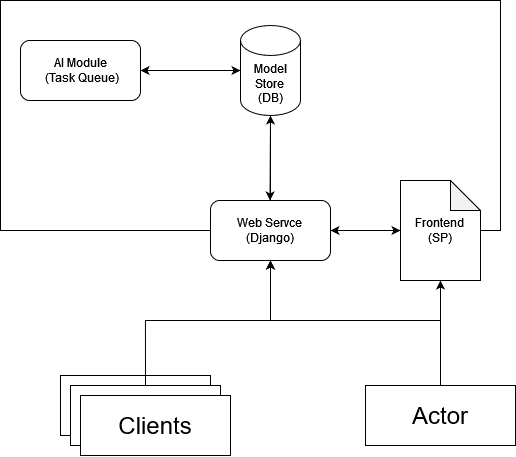
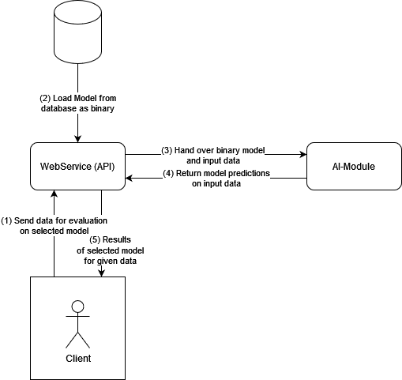
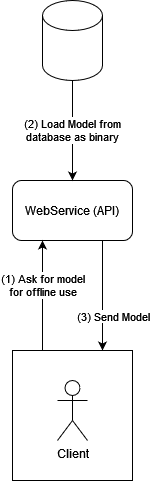
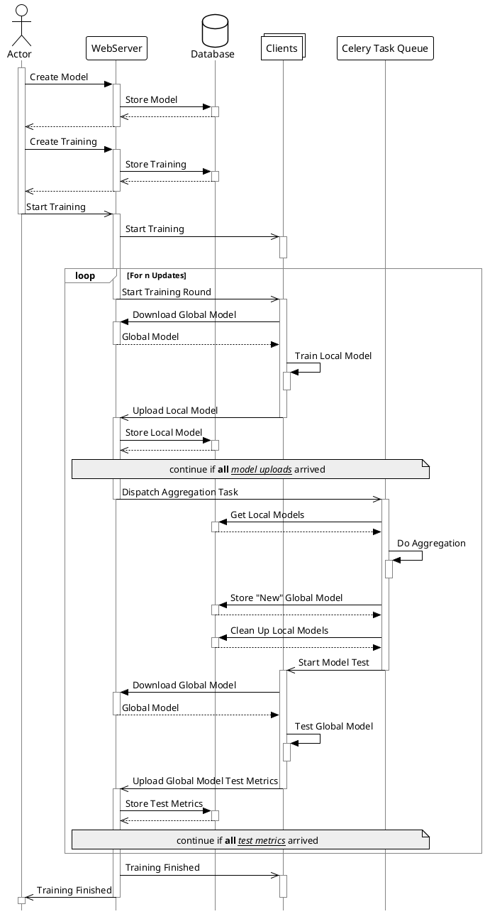
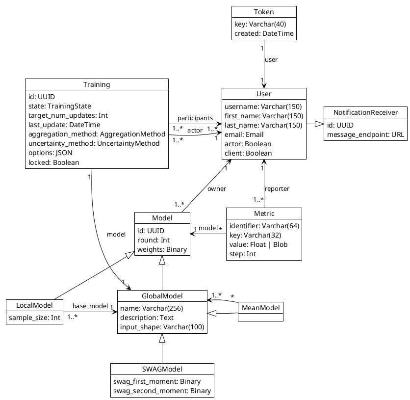
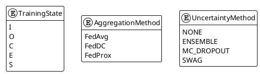

---
hide:
    - navigation
---
<!--
SPDX-FileCopyrightText: 2024 Benedikt Franke <benedikt.franke@dlr.de>
SPDX-FileCopyrightText: 2024 Florian Heinrich <florian.heinrich@dlr.de>

SPDX-License-Identifier: CC-BY-4.0
-->

# Architecture

Welcome to the architectural documentation for the FL platform.
This document serves as a high-level introduction to the architecture underpinning our advanced platform, designed to provide insight into how we've structured our system to meet our goals of scalability, performance, and reliability.
This overview will guide you through the main components, their interactions, and the key design decisions that shape our system.

## Key Points

DLR Federated Learning platform is:

- executable on the majority of Linux systems
- implemented in Python (>=3.10)
- providable via Docker container
- compatible to the AI library PyTorch

## Technical Context

On a high level, the FL platform consists of a web API, a task queue for the AI and a database for persistence.
The Web-API can also be used via single page fronted application.

Inference can occur online, enabling predictions directly from a server-hosted model without downloading it to the client.
This method ensures seamless predictions and accommodates clients with varying computational capacities, streamlining accessibility and efficiency.

Alternatively, clients can download the model for offline usage.
This option provides flexibility, allowing users to access predictive capabilities without transfering the data, enhancing usability in varied environments while ensuring the model's utility is maximized across different scenarios.

## Training Process

The training cycle begins when an actor (user or system administrator) initiates the creation of a new machine learning model.
This model is then stored in a central database through interactions with the web server.
Following model creation, the actor sets up a training regime that is also registered in the database.

Once initiated, the training enters a loop, repeating for a pre-determined number of iterations.
In each iteration, the clients — distributed computing nodes — download the latest global model from the database.
They then use this global model as a foundation to train local models on their respective datasets.
These local models, containing incremental learning updates, are uploaded back to the web server, which in turn stores them in the database.

After all the local models from the clients have been uploaded, the web server triggers an aggregation task.
This task is responsible for merging the local models to update the global model, utilizing techniques to ensure the global model learns appropriately from the distributed data.
Once the aggregation is complete, the new global model is stored, and any old local models are purged from the database to maintain data hygiene.

Subsequently, the global model undergoes testing to evaluate its performance.
The test metrics generated from this evaluation phase are uploaded to the web server and stored in the database.
The cycle is complete when the pre-determined number of iterations has been completed.
This architecture facilitates continuous improvement of the model while leveraging distributed data sources, optimizing model performance without compromising data privacy or security.

## Data Model

Our platform contains a polymorphic data model like the depicted below.

## Glossary

See: <https://developers.google.com/machine-learning/glossary?hl=en>
