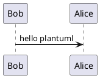

<!-- markdownlint-disable-next-line MD025 -->
# Federated Learning Platform Documentation

The Federated Learning Platform from the [German Aerospace Center (DLR)](https://www.dlr.de/en) is launched as
part of the [Catena-X Automotive Network](https://catena-x.net/en) project which was sponsored by the
[German Federal Ministry of Economics Affairs and Climate Action](https://www.bmwk.de/Navigation/EN/Home/home.html).

TODO

## Repositories

TODO

<!--

## Project layout

```text
mkdocs.yml    # The configuration file.
docs/
    index.md  # The documentation homepage.
    ...       # Other markdown pages, images and other files.
```

## Code

```python title="example.py" linenums="1" hl_lines="5 6"
import logging

logger = logging.getLogger("example")

if __name__ == "__main__":
    print("Hello World!")
```

=== "Latest"
    ``` sh
    pip install mkdocs-material
    ```

=== "9.x"
    ``` sh
    pip install mkdocs-material=="9.*" # (1)!
    ```

## PlantUML

````markdown



-->
