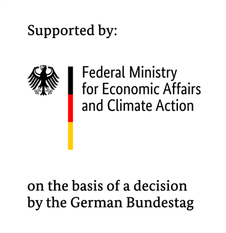
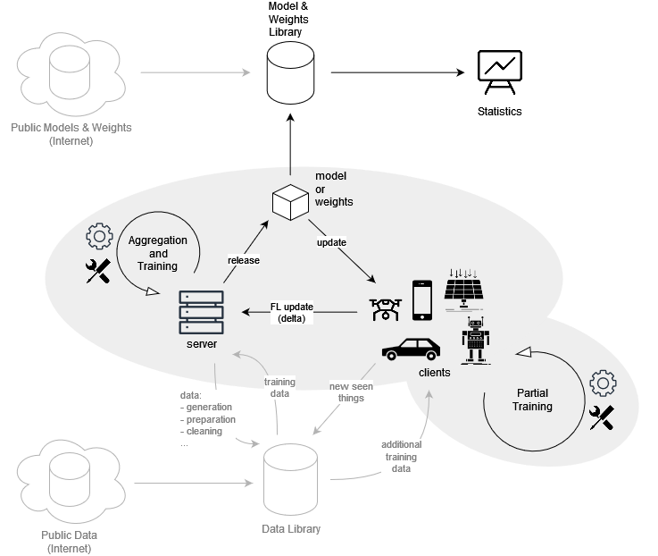

<!--
SPDX-FileCopyrightText: 2024 Benedikt Franke <benedikt.franke@dlr.de>
SPDX-FileCopyrightText: 2024 Florian Heinrich <florian.heinrich@dlr.de>

SPDX-License-Identifier: CC-BY-4.0
-->

<!-- markdownlint-disable-next-line MD025 -->
# Federated Learning Platform Documentation

The Federated Learning Platform from the [German Aerospace Center (DLR)](https://www.dlr.de/en) is launched as
part of the [Catena-X Automotive Network](https://catena-x.net/en) project which was sponsored by the
[German Federal Ministry of Economics Affairs and Climate Action](https://www.bmwk.de/Navigation/EN/Home/home.html).

    

        
        
        

            
            
        

    

    

        
        
        
    

The entire platform is a Prove of Concept (PoC).
It is intended to show that decentralized machine learning is possible in the industry and the Catena-X automotive network.

## Repositories

| Repository                                                                     |                                                                                 Actions                                                                                 |                            Pages                            |                                               Registry                                               | Description                                                                             |
| :----------------------------------------------------------------------------- | :---------------------------------------------------------------------------------------------------------------------------------------------------------------------: | :---------------------------------------------------------: | :--------------------------------------------------------------------------------------------------: | :-------------------------------------------------------------------------------------- |
| [fl-documentation](https://github.com/DLR-KI/fl-documentation)                 |                  |     [:link:](https://dlr-ki.github.io/fl-documentation)     |                                               &ndash;                                                | Official documentation of the Federated Learning platform                               |
| [fl-demonstrator](https://github.com/DLR-KI/fl-demonstrator)                   |                    |     [:link:](https://dlr-ki.github.io/fl-demonstrator)      |             [:link:](https://github.com/orgs/DLR-KI/packages?repo_name=fl-demonstrator)              | A set of tools for demonstrating machine learning in a federated environment            |
| [fl-demonstrator-frontend](https://github.com/DLR-KI/fl-demonstrator-frontend) |  | [:link:](https://dlr-ki.github.io/fl-demonstrator-frontend) | [:link:](https://github.com/DLR-KI/fl-demonstrator-frontend/pkgs/container/fl-demonstrator-frontend) | A frontend for the federated learning demonstrator                                      |
| [fl-demonstrator-mnist](https://github.com/DLR-KI/fl-demonstrator-mnist)       |        |  [:link:](https://dlr-ki.github.io/fl-demonstrator-mnist)   |    [:link:](https://github.com/DLR-KI/fl-demonstrator-mnist/pkgs/container/fl-demonstrator-mnist)    | MNIST example client of the federated learning platform                                 |
| [fl-demonstrator-client](https://github.com/DLR-KI/fl-demonstrator-client)     |      |  [:link:](https://dlr-ki.github.io/fl-demonstrator-client)  |   [:link:](https://github.com/DLR-KI/fl-demonstrator-client/pkgs/container/fl-demonstrator-client)   | A small client base package including client server communication helpers               |
| [fl-logging-base](https://github.com/DLR-KI/fl-logging-base)                   |                    |     [:link:](https://dlr-ki.github.io/fl-logging-base)      |                                               &ndash;                                                | Package to simplify the process of enabling consistent logging across multiple projects |

## Federated Learning Overview

Federated Machine Learning (FL) represents a paradigm shift in the way we approach machine learning model training and deployment.
Unlike traditional centralized machine learning models, which require data to be uploaded and processed on a central server, FL decentralizes the training process, bringing the model directly to the source of the data.
This approach not only mitigates privacy concerns by allowing data to remain on local devices, but also reduces the need for large-scale data transmission, which can be both costly and inefficient.

At its core, FL involves distributing the machine learning algorithm across multiple devices or servers, each holding its own subset of data.
These distributed models are trained locally on these devices, and only the model updates — rather than the raw data — are sent to a central server.
The server then aggregates these updates to improve the global model, which is subsequently distributed back to the local devices for further training.
This cycle continues until the model reaches an optimal level of accuracy and performance.

One of the most compelling advantages of FL is its potential to enhance privacy and security, as sensitive data does not need to leave its original location.
This aspect is particularly crucial when dealing with critical business information, where data sensitivity is paramount.
Moreover, by leveraging data from a wide range of devices in diverse environments, FL can lead to more robust and generalizable models that perform well across different scenarios and conditions.

<figure markdown="span">
  
  <figcaption>DLR Federated Learning Ecosystem</figcaption>
</figure>

### Challenges

Key challenges in FL revolve around ensuring the model updates' transmission is both efficient and secure, a task complicated by the unstable nature of communication channels.
The data itself, inherently diverse and distributed across countless devices, must remain high-quality and consistent.
This endeavor is complicated by the presence of non-IID data, where information collected from various users varies widely, not only in nature but also in volume, leading to unbalanced data sets.

Moreover, the landscape of FL is massively distributed — often the number of users significantly surpasses the number of samples available on each device.
This distribution, while a strength, introduces complexities in learning, as local models may diverge from the optimal solution due to the varied computing power of clients.
To combat these discrepancies and guide these local models back towards a global optimum, FL employs specialized averaging strategies.
These strategies address the challenges of client heterogeneity, ensuring that despite the vast and varied landscape of data and devices, federated learning can achieve coherent and effective learning outcomes.

## Documentation Content

- Home
- [Architecture](./architecture/index.md)
- [Aggregation Strategies](./aggregation/index.md)
- [Uncertainty Methods](./uncertainty/index.md)
- [Tutorial](./tutorial/index.md)
