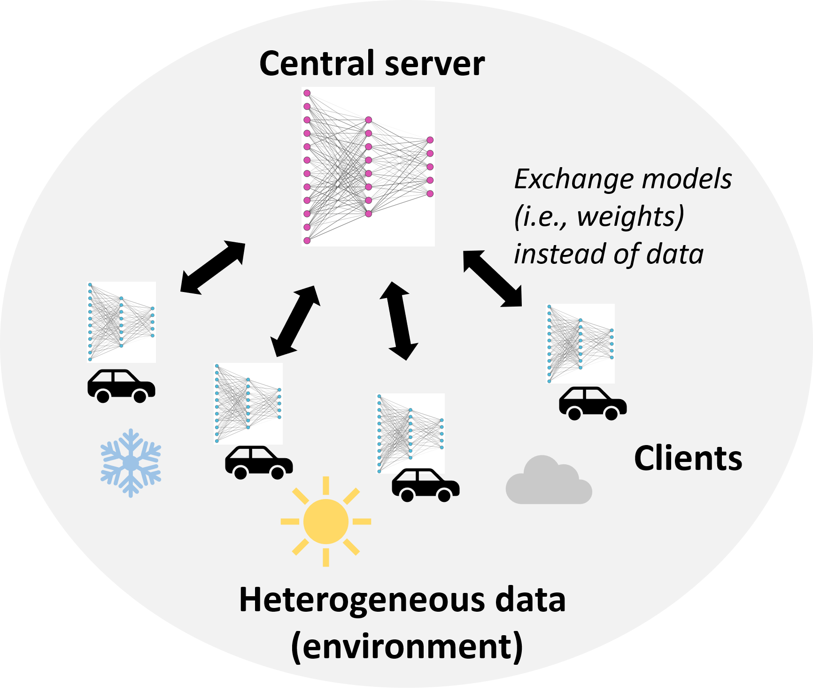
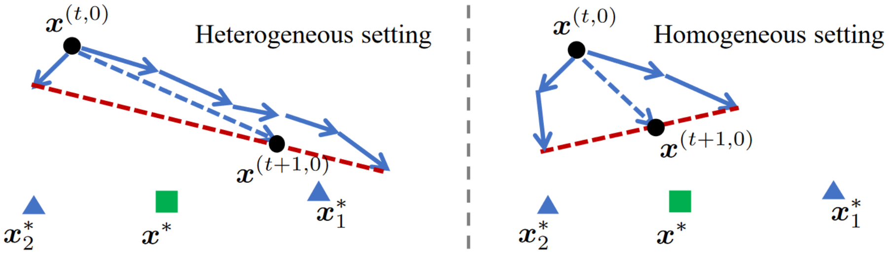
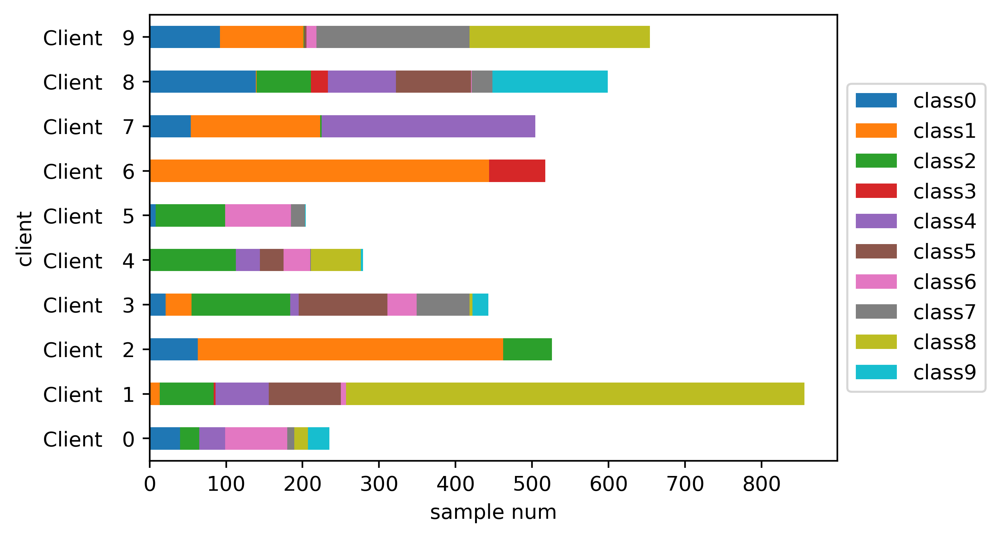

# Basic Knowledge

To follow the tutorial and understand what it does and why you do this, it is very important to at least know what
_Machine Learning_ and in particular _Federated Learning_ is.

## Machine Learning

Machine Learning is a subset of artificial intelligence (AI) that provides systems the ability to automatically learn
and improve from experience without being explicitly programmed.
It focuses on the development of computer programs that can access data and use it to learn for themselves.

The process of learning begins with observations or data, such as examples, direct experience, or instruction, in order
to look for patterns in data and make better decisions in the future based on the examples that we provide.
The primary aim is to allow the computers to learn automatically without human intervention or assistance and adjust
actions accordingly.

/// details | Statistics
    type: note
    open: True

Machine Learning is largely based on statistics.
It uses statistical models to draw patterns and make predictions from data.
These models allow algorithms to learn from and make decisions or predictions based on data.
So, in essence, Machine Learning is a form of applied statistics and comes with all its advantages and disadvantages.

///

## Federated Learning

{width=40%, align=right}

Federated Learning is a Machine learning approach where a model is trained across multiple decentralized devices or
servers holding local data samples, without exchanging them.
This approach allows for data privacy, data locality, and system heterogeneity.

In traditional Machine learning, all the data needs to be centralized in one location for model training.
However, in Federated Learning, the data remains in its original location, and only the model updates are shared, thus
preserving privacy and reducing communication costs.

The relationship between Federated Learning and Machine Learning is that Federated Learning is a specific technique
within the broader field of Machine Learning, designed to handle scenarios where data privacy and security are
important.

/// details | Federated Learning challenges
    type: info

Federated Learning and it's fundermental concept to keep the data private and have them decentralized comes with its
own challenges.
Some of these challenges, which can have a major impact on training, are:

- **Non-IID data**: Data generated by each user or client can be very heterogenous
    - Problem of **client heterogeneity**: local models drift away from true optima $\rightarrow$ must use specialized
        averaging strategies (FedProx, FedDC, ...)
    <figure markdown>
        
        <figcaption>
            Heterogeneous and homogeneous setting [[Source][2]]
        </figcaption>
    </figure>
- **Unbalanced data**: Some users produce more data than others
    <figure markdown>
        
        <figcaption>
            Unbalanced data distribution [[Source][3]]
        </figcaption>
    </figure>
- **Massively distributed**: Number of users >> numbers of samples on each device
- **Unstable** communication channels
- **Computing power** of clients varies

///

<!-- markdownlint-disable-next-line MD053 -->
[2]: https://proceedings.neurips.cc/paper/2020/hash/564127c03caab942e503ee6f810f54fd-Abstract.html
<!-- markdownlint-disable-next-line MD053 -->
[3]: https://github.com/SMILELab-FL/FedLab/tree/c0fea8500bc46c526d03e9f53cb1c6518bebb5ab/tutorials/Datasets-DataPartitioner-tutorials/imgs/cifar10_hetero_dir_0.3_100clients.png
