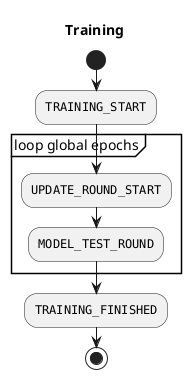
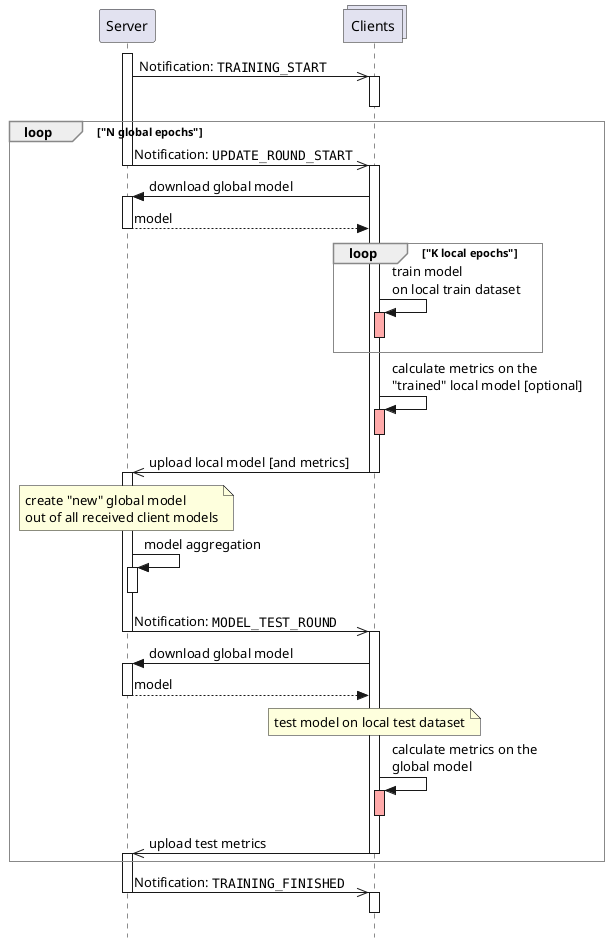

<!-- markdownlint-disable-next-line MD025 -->
# Client $\leftrightarrow$ Server communication

## Preparations

Prior to initiating a training session, numerous preparation steps need to be carried out:

**Create Actor**: This involves setting up the individual account that will be managing the training.
This could refer to an individual or a collective group who are responsible for the training.
The actor might also be seen as the steward and coordinator of the training as well as its outcomes.

**Create Participants**: This involves identifying or setting up the individuals that will be participating in the
training.
Ultimately, the participants are represented by HTTP(S) endpoints, which are targeted through notifications.
These endpoints simply need to respond appropriately and relay their results back to the server.

**Create Model**: This involves providing a model that will be used during the training.
This could mean selecting a pre-existing model or creating a new one.

**Create Training**: This involves consolidating the earlier discussed elements into a training object.
The actual training process incorporates the actor, the participants, and the model to be trained.
It's worth noting that an actor can also serve as a participant simultaneously.
Additionally, key training parameters are established at this point.
These parameters might include the aggregation method to be employed and the total number of global epochs for the
entire training.

**Start Training**: This is the final step, where the actual training begins.
The actor gives the start signal and all participants receive a corresponding notification.

## Training Procedure

Once a training session is initiated, the server will independently manage the training with the assistance of the
participants (or their endpoints).

In this process, the server manages all operations through notifications.
Each notification is sent individually to each client via an HTTP(S) request.
The most crucial notifications and a high-level overview of the notification-based training procedure are as follows:

<figure>



<figcaption>Training process notifications</figcaption>
</figure>

//// details | Primary Types of Notifications and their Associated Body Contents
    type: note
    open: True

In the following is a comprehensive overview of the most significant [Notifications][1], including their HTTP(S) body
contents, that a client would receive from the server throughout the course of a training session.

/// details | Training Start Notification - `TRAINING_START`
    type: info

Notification that a new training is about to start.

```json
{
    "notification_type": "TRAINING_START",
    "training_uuid": "string",
    "body": {
        "global_model_uuid": "string"
    }
}
```

///

/// details | Training Round Start Notification - `UPDATE_ROUND_START`
    type: info

Notification that a new trainings round or the next global epoch starts.

```json
{
    "notification_type": "UPDATE_ROUND_START",
    "training_uuid": "string",
    "body": {
        "round": "number",
        "global_model_uuid": "string"
    }
}
```

///

/// details | Training Model Test Notification - `MODEL_TEST_ROUND`
    type: info

Notification that the latest global model should be evaluated.

```json
{
    "notification_type": "MODEL_TEST_ROUND",
    "training_uuid": "string",
    "body": {
        "round": "number",
        "global_model_uuid": "string"
    }
}
```

///

/// details | Training Finished Notification - `TRAINING_FINISHED`
    type: info

Notification that indicats the completion of a training process.

```json
{
    "notification_type": "TRAINING_FINISHED",
    "training_uuid": "string",
    "body": {
        "global_model_uuid": "string"
    }
}
```

///

////

A more detailed perspective of the entire training process, including the communication between the server and clients
as well as their primary tasks, can be visualized in the subsequent diagram.



/// details | Where should your focus be?
    type: important
    open: True

If you're utilizing Python and the supportive Python package [`fl-demonstrator-client`][2] provided by the DLR Federated
Learning Ecosystem, you can use the tutorial example project as a template for your own project.
Just focus on the parts highlighted in red, modify them accordingly, and you'll be able to train your own impressive
models.

In summary, your primary focus should be on the actual training (highlighted in the first red box) and possibly tweaking
the existing testing method (indicated or called in the second and third red boxes).
It's almost like you're implementing a condensed version of a traditional Machine Learning training script, with
everything else taken care of for you.

///

[1]: https://dlr-ki.github.io/fl-demonstrator/fl_server_ai/notification/index.html
[2]: https://github.com/DLR-KI/fl-demonstrator-client
