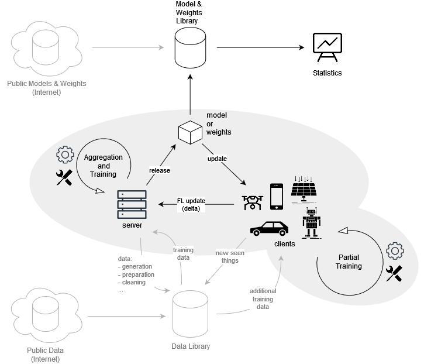

# Components and Interation

The DLR Federated Learning ecosystem you will work on involves two main components: the server and the clients.
Communication between these components is crucial, especially for the exchange of model and metadata.
An independent component of this setup is the statistics web server, which simply provides model statistics and other
useful information.

While the server in this architecture is mainly fixed, the client-side training is flexible.
You have the freedom to create and shape your own client training, tailoring it to your specific needs and objectives.
This flexibility allows for a more personalized and efficient approach to Machine learning.

In the following tutorial, you will create a simple project to train models based on the popular [MNIST][1] dataset.
This dataset is a large collection of handwritten digits and is widely used in the field of Machine learning and image
processing.
It provides a solid foundation for training and testing Machine learning models, particularly those involved in image
recognition tasks.

The tutorial project is written in Python, a versatile and widely-used programming language that is particularly strong
in the field of Machine learning.
Python's extensive library support and easy-to-read syntax make it an excellent choice for developing Machine learning
clients.

The source code on which the tutorial is based for the process of training a neural network is taken from
[PyTorch's traditional Machine Learning MNIST example][2].
[PyTorch][3] is a powerful open-source Machine learning library for Python, and its MNIST example is a well-established
benchmark in the field.
However, it's important to note that this example does not involve Federated Learning.
Hence, you will create it :winking_face:.

To assist you in this process, the DLR Federated Learning Ecosystem provides a small Python package:
[`fl-demonstrator-client`][4].
This package is specifically designed to support the development of Federated Learning clients inside the DLR Federated
Learning Ecosystem, providing a range of tools and convenient features to streamline the process.
It should be noted that this package is not really required or necessary, but by e.g. handling all the communication
parts, it allows you to focus on the unique aspects of your client, speeding up development time and reducing the
potential for errors.

The complete [MNIST example client project and code][5] is open source and can be found on GitLab.

[1]: http://yann.lecun.com/exdb/mnist
[2]: https://github.com/pytorch/examples/blob/55c663f9a50f79cb6a905c56d886343c555d34a9/mnist/main.py
[3]: https://pytorch.org
[4]: https://github.com/DLR-KI/fl-demonstrator-client
[5]: https://github.com/DLR-KI/fl-demonstrator-mnist
